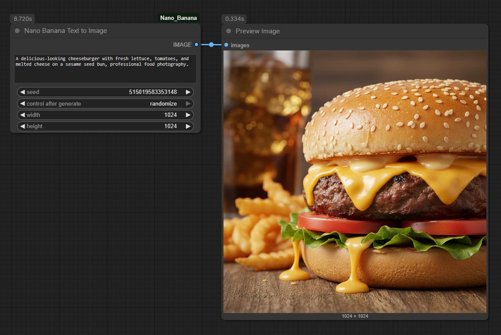
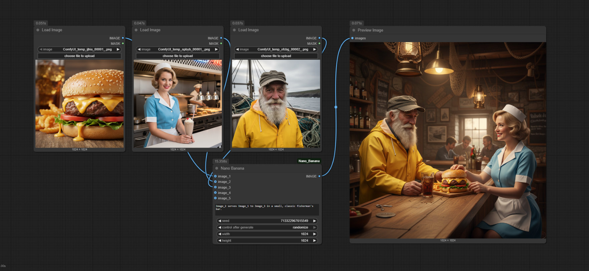

# ComfyUI_Nano_Banana

[](https://opensource.org/licenses/MIT)
[](https://www.python.org/downloads/release/python-3120/)
[](https://deepmind.google/technologies/gemini/)

A set of custom nodes for ComfyUI that leverage the Gemini 2.5 Flash Image Preview API to generate images from text prompts, single images, and multiple images.

## Installation

1.  Clone this repository into your `custom_nodes` folder.
    ```bash
    cd ComfyUI/custom_nodes
    git clone https://github.com/your_username/ComfyUI_Nano_Banana.git
    ```
2.  Install the required dependencies:
    ```bash
    pip install -r ComfyUI_Nano_Banana/requirements.txt
    ```

## Nodes

### Nano Banana

## Model Limitations

Please be aware that the `gemini-2.5-flash-image-preview` model used by these nodes has a fixed output resolution of 1024x1024 pixels. While the node provides `width` and `height` inputs, these are primarily for compatibility with ComfyUI's interface and do not directly control the output resolution of the generated image. The model will always produce a 1024x1024 image.

Attempting to influence the aspect ratio by including it in the prompt (e.g., "a dog, aspect ratio 16:9") acts as a compositional hint to the model, guiding how it frames the image within the 1024x1024 canvas. It does not change the actual pixel dimensions of the output.

This node provides a flexible interface for image generation, supporting text-to-image and image-to-image workflows with up to five reference images.

**Inputs:**

*   `prompt` (STRING): The text prompt for image generation or manipulation.
*   `seed` (INT, optional): Seed for reproducibility (default: 0).
*   `width` (INT, optional): Width of the generated image (default: 1024). Used primarily for text-to-image generation.
*   `height` (INT, optional): Height of the generated image (default: 1024). Used primarily for text-to-image generation.
*   `image_1` to `image_5` (IMAGE, optional): Up to five reference images. Provide at least one image for image-to-image generation.

**Outputs:**

*   `image` (IMAGE): The generated image.


## API Key Setup

To use these nodes, you need a Google AI API key. You can obtain one from the [Google AI Studio](https://aistudio.google.com/app/apikey). Please note that the Gemini API is a paid service and may incur costs.

Create a `config.json` file in the `ComfyUI_Nano_Banana` directory with the following content:

```json
{
  "api_key": "YOUR_API_KEY_HERE",
  "url_endpoint": "https://generativelanguage.googleapis.com/v1alpha/models/gemini-2.5-flash-image-preview:generateContent"
}
```

## Example Usage

!Important Make sure your API key is set up in 'config.json'.

### Text to Image Generation

1.  Add the `NanoBanana` node to your workflow.
2.  Enter a `prompt`.
3.  Ensure no `image_` inputs are connected.
4.  Connect the output `image` to a `PreviewImage` node to see the result.

**Sample Prompt:** "A delicious-looking cheeseburger with fresh lettuce, tomatoes, and melted cheese on a sesame seed bun, professional food photography"




### Image to Image Generation (with 1 to 5 reference images)

1.  Add the `NanoBanana` node to your workflow.
2.  Connect one or more `LoadImage` nodes (up to 5) to the `image_1` to `image_5` inputs.
3.  Enter a `prompt` describing the desired changes or outcome.
4.  Connect the output `image` to a `PreviewImage` node.

**Sample Prompt:** "Image_2 serves Image_1 to Image_3 in a small, classic fisherman's bar."




## License

This project is licensed under the MIT License - see the [LICENSE](LICENSE) file for details.