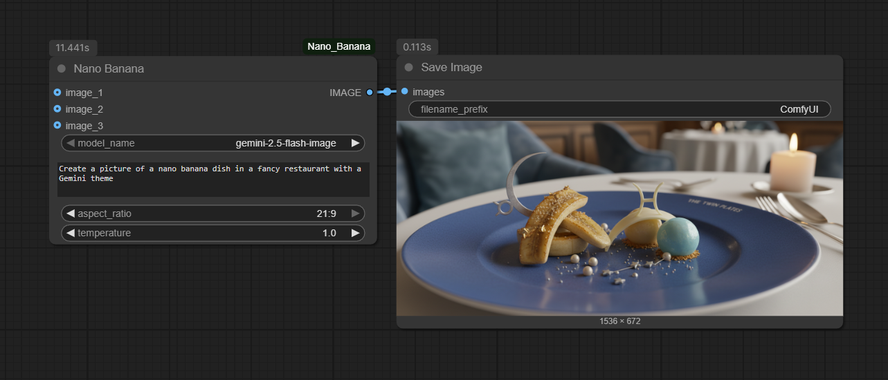
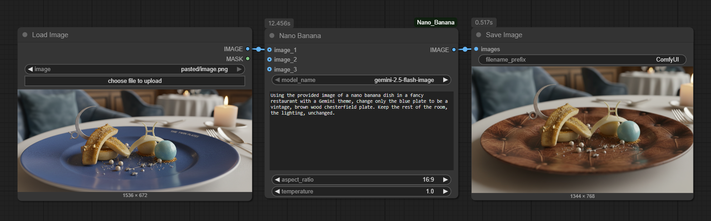

# ComfyUI_Nano_Banana

[](https://opensource.org/licenses/MIT)
[](https://www.python.org/downloads/release/python-3120/)
[](https://deepmind.google/technologies/gemini/)

A set of custom nodes for ComfyUI that leverage the official Google Generative AI SDK to generate images from text prompts, single images, and multiple images with configurable aspect ratios and resolutions using the Gemini 2.5 Flash Image model.

## Changelog
### Version 2.0 - The Fusion & Control Update
This is a complete overhaul of the Nano Banana node, moving from a gemini-2.5-flash-image-preview model to gemini-2.5-flash-image.

New Feature: Full Aspect Ratio Control!
The single biggest upgrade. You can now select from 10 different aspect ratios (like 16:9, 9:16, 4:3, etc.) and the node will generate an image with the correct dimensions. The old 1024x1024 limitation has been removed.

New Feature: Creative Control with Temperature
A new temperature input has been added, allowing you to control the randomness and creativity of the generated image.

Improved: Multi-Image Fusion
Image-to-image workflows have been rebuilt from the ground up. The node now robustly supports true multi-image fusion using up to three reference images.

Removed:
The non-functional width, height, and seed inputs have been removed in favor of the superior aspect_ratio and temperature controls.

## Installation

1.  Clone this repository into your `custom_nodes` folder.
    ```bash
    cd ComfyUI/custom_nodes
    git clone https://github.com/ru4ls/ComfyUI_Nano_Banana.git
    ```
2.  Install the required dependencies:
    ```bash
    pip install -r ComfyUI_Nano_Banana/requirements.txt
    ```

## Nodes

### Nano Banana

This node provides a flexible interface for image generation with support for multiple aspect ratios, supporting text-to-image and image-to-image workflows with up to three reference images using the official Google Generative AI SDK.

**Inputs:**

*   `prompt` (STRING): The text prompt for image generation or manipulation.
*   `image_1` to `image_3` (IMAGE, optional): Up to three reference images. Provide at least one image for image-to-image generation.
*   `aspect_ratio` (STRING): The output aspect ratio for the generated image. Options include: `1:1`, `2:3`, `3:2`, `3:4`, `4:3`, `4:5`, `5:4`, `9:16`, `16:9`, `21:9` (default: `1:1`).
*   `temperature` (FLOAT, optional): Controls the creative randomness of the output. Higher values (e.g., 1.2) are more creative, lower values (e.g., 0.5) are more deterministic.


**Available Aspect Ratios & Resolutions:**
*   `1:1` - 1024x1024 (square)
*   `2:3` - 832x1248 (portrait)
*   `3:2` - 1248x832 (landscape)
*   `3:4` - 864x1184 (portrait)
*   `4:3` - 1184x864 (landscape)
*   `4:5` - 896x1152 (portrait)
*   `5:4` - 1152x896 (landscape)
*   `9:16` - 768x1344 (vertical/video)
*   `16:9` - 1344x768 (horizontal/video)
*   `21:9` - 1536x672 (ultrawide)

**Outputs:**

*   `image` (IMAGE): The generated image.


## API Key Setup

To use these nodes, you need a Google AI API key. You can obtain one from the [Google AI Studio](https://aistudio.google.com/app/apikey). Please note that the Gemini API is a paid service and may incur costs.

Create a `.env` file in the `ComfyUI_Nano_Banana` directory with the following content:

```
GOOGLE_API_KEY="YOUR_API_KEY"
```

## Example Usage

!Important Make sure your API key is set up in the `.env` file.

### Text to Image Generation (with configurable aspect ratio)

1.  Add the `NanoBanana` node to your workflow.
2.  Select your desired `aspect_ratio` from the dropdown (e.g., `16:9` for wide landscape, `9:16` for vertical, etc.).
3.  Enter a `prompt`.
4.  Ensure no `image_` inputs are connected.
5.  Connect the output `image` to a `PreviewImage` or `SaveImage` node to see the result.

**Sample Prompt:** "Create a picture of a nano banana dish in a fancy restaurant with a Gemini theme"




### Image Editing and Image Fusion Generation (with configurable aspect ratio and 1 to 3 reference images)

1.  Add the `NanoBanana` node to your workflow.
2.  Select your desired `aspect_ratio` from the dropdown (the original images will be adapted to this output aspect ratio).
3.  Connect one or more `LoadImage` nodes (up to 3) to the `image_1` to `image_3` inputs.
4.  Enter a `prompt` describing the desired changes or outcome.
5.  Connect the output `image` to a `PreviewImage` or `SaveImage` node to see the result.

**Sample Prompt:** "Using the provided image of a nano banana dish in a fancy restaurant with a Gemini theme, change only the blue plate to be a vintage, brown wood chesterfield plate. Keep the rest of the room, the lighting, unchanged."




## License

This project is licensed under the MIT License - see the [LICENSE](LICENSE) file for details.