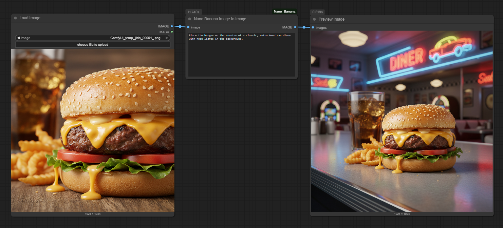

# ComfyUI_Nano_Banana

[](https://opensource.org/licenses/MIT)
[](https://www.python.org/downloads/release/python-3120/)
[](https://deepmind.google/technologies/gemini/)

A set of custom nodes for ComfyUI that leverage the Gemini 2.5 Flash Image Preview API to generate images from text prompts, single images, and multiple images.

## Installation

To install the Nano Banana nodes, clone this repository into your `ComfyUI/custom_nodes/` directory:

```bash
git clone https://github.com/ru4ls/ComfyUI_Nano_Banana.git
```

## Dependencies

*   `requests`

You can install the required packages using pip:

```bash
pip install -r requirements.txt
```

Then, restart ComfyUI.

## API Key Setup

To use these nodes, you need a Google AI API key. You can obtain one from the [Google AI Studio](https://aistudio.google.com/app/apikey). Please note that the Gemini API is a paid service and may incur costs.

Create a `config.json` file in the `ComfyUI_Nano_Banana` directory with the following content:

```json
{
  "api_key": "YOUR_API_KEY_HERE",
  "url_endpoint": "https://generativelanguage.googleapis.com/v1alpha/models/gemini-2.5-flash-image-preview:generateContent"
}
```

## Nodes

### Nano Banana Text-To-Image

This node generates an image from a text prompt using the Gemini 2.5 Flash Image Preview API.


**Inputs:**

*   `prompt`: The text prompt for the image generation.
*   `seed`: The seed for the generation (default: 0).
*   `width`: The width of the generated image (default: 1024).
*   `height`: The height of the generated image (default: 1024).

**Output:**

*   `image`: The generated image.


### Nano Banana Image-To-Image

This node takes a single input image and a text prompt to generate a new image.



**Inputs:**

*   `prompt`: A text prompt describing the desired changes.
*   `image`: The source image.

**Output:**

*   `image`: The newly generated image.


### Nano Banana Multi-Image-To-Image

This node takes multiple input images and a text prompt to generate a new image, allowing the model to reference all provided images.


**Inputs:**

*   `prompt`: A text prompt describing the desired outcome.
*   `image1`: The first source image.
*   `image2`: (Optional) The second source image.

**Output:**

*   `image`: The newly generated image.


## Example Usage

!Important Make sure your API key is set up in 'config.json'.

### Text to Image

1.  Add the `NanoBananaTextToImage` node to your workflow.
3.  Enter a prompt.
4.  Connect the output `image` to a `PreviewImage` node to see the result.

### Image to Image

1.  Add the `NanoBananaImageToImage` node to your workflow.
2.  Connect a `LoadImage` node to the `image` input.
4.  Enter a prompt describing the changes you want to make.
5.  Connect the output `image` to a `PreviewImage` node.

### Multi-Image to Image

1.  Add the `NanoBananaMultiImageToImage` node to your workflow.
2.  Connect two `LoadImage` nodes to the `image1` and `image2` inputs.
4.  Enter a prompt.
5.  Connect the output `image` to a `PreviewImage` node.


## License

This project is licensed under the MIT License - see the [LICENSE](LICENSE) file for details.
